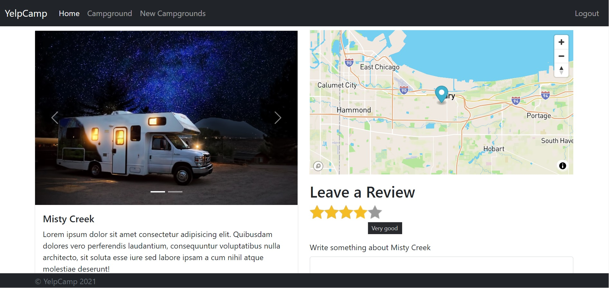

# YelpCamp

view the best campgrounds sites, you can search by location post your own campgrounds and reviews 

## Installation

Install YelpCamp with npm

```bash
  cd YelpCamp
  npm install package.json
```

to run demo campgrounds you can use the index.js in the seeds folder.
    
## Environment Variables

To run this project, you will need to add the following environment variables to your .env file

`CLOUDINARY_CLOUD_NAME`

`CLOUDINARY_KEY`

`CLOUDINARY_SECRET`

Cloudinary variables to host images

`MAPBOX_TOKEN`

MapBox to embed the map

`DB_URL`

your MongoDB server name


## Screenshots




